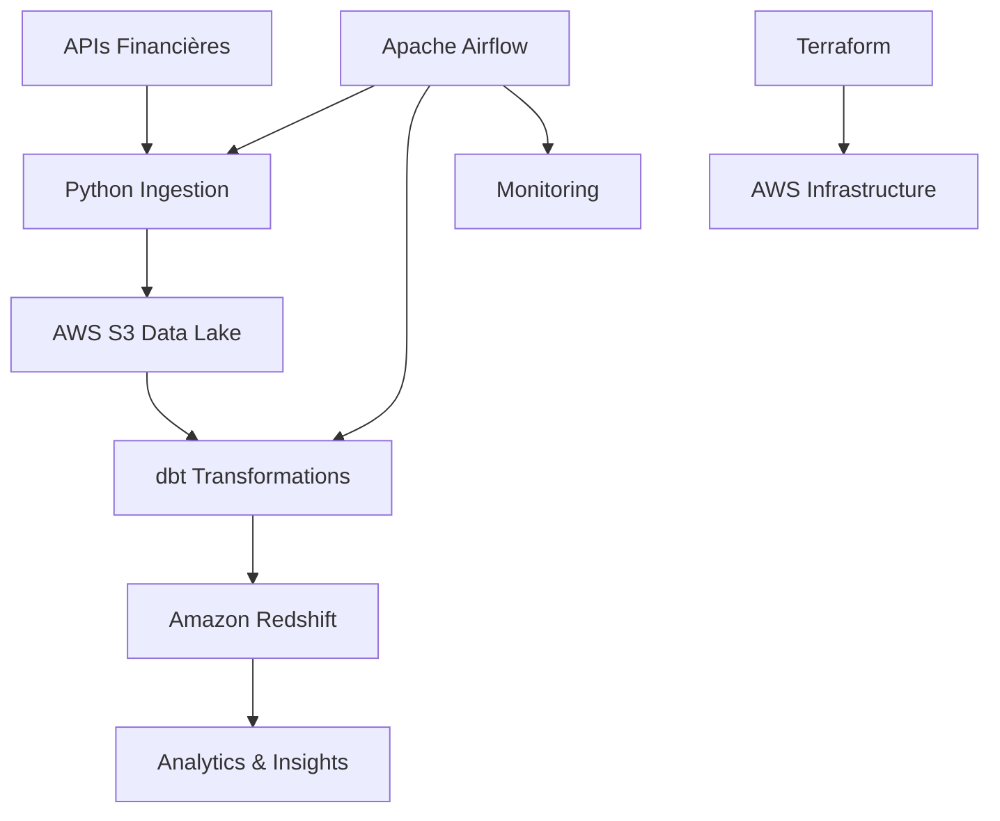

# Sectoral 📊

> **Pipeline d'analyse sectorielle automatisée des marchés financiers**

Sectoral est un projet de data engineering qui démontre la mise en place d'un pipeline complet d'ingestion, transformation et analyse de données financières, avec un focus sur les performances sectorielles des marchés boursiers.

## 🎯 Vision du Projet

**Problématique Business** : Les investisseurs institutionnels ont besoin d'outils automatisés pour identifier les tendances sectorielles, optimiser leurs allocations d'actifs et détecter les opportunités de rotation sectorielle.

**Solution Technique** : Pipeline de données moderne utilisant les meilleures pratiques du data engineering pour transformer des données financières brutes en insights business actionnables.

## 🏗️ Architecture



## 🛠️ Stack Technique

| Composant | Technologie | Rôle |
|-----------|------------|------|
| **Orchestration** | Apache Airflow (MWAA) | Scheduling et monitoring des pipelines |
| **Infrastructure** | Terraform + AWS | Infrastructure as Code |
| **Ingestion** | Python (pandas, yfinance) | Collecte de données depuis APIs |
| **Stockage** | AWS S3 + Amazon Redshift | Data Lake + Data Warehouse |
| **Transformation** | dbt Core | Modélisation et transformations SQL |
| **Monitoring** | CloudWatch + Airflow UI | Observabilité et alertes |

## 📈 Sources de Données

- **Yahoo Finance API** : Prix des actions, volumes, données historiques
- **Alpha Vantage API** : Données sectorielles et métadonnées
- **FRED API** : Indicateurs macro-économiques (taux, inflation)

## 🚀 Quick Start

### Prérequis
- Python 3.8+
- AWS Account
- Terraform installé

### POC Locale
```bash
# Installation
pip install yfinance pandas numpy

# Exécution de la POC
python sectoral_poc.py

# Résultats
ls sectoral_*.csv
```

### Déploiement Complet
```bash
# Infrastructure
cd terraform/
terraform init && terraform apply

# Configuration Airflow
# Voir DETAILED_README.md pour les étapes complètes
```

## 📊 Métriques Calculées

### Performance
- Rendements sectoriels (quotidiens, cumulés)
- Comparaisons de performance relative
- Analyse de momentum sectoriel

### Risque
- Volatilité par secteur (30j, 1an)
- Ratios de Sharpe sectoriels
- Value at Risk (VaR)

### Corrélations
- Matrice de corrélations inter-sectorielles
- Analyse de diversification
- Détection de régimes de marché

## 🎯 Cas d'Usage Business

1. **Rotation Sectorielle** : Identification des secteurs sur/sous-performants
2. **Allocation d'Actifs** : Optimisation de la diversification sectorielle  
3. **Risk Management** : Monitoring des concentrations de risque
4. **Trading Signals** : Signaux d'achat/vente basés sur les tendances

## 📁 Structure du Projet

```
sectoral/
├── README.md                 # Ce fichier
├── DETAILED_README.md        # Documentation technique détaillée
├── sectoral_poc.py          # Proof of Concept
├── terraform/               # Infrastructure as Code
├── airflow/                 # DAGs et configuration
├── dbt/                     # Modèles de transformation
├── python-scripts/          # Scripts d'ingestion
└── docs/                    # Documentation supplémentaire
```

## 🏆 Objectifs d'Apprentissage

### Compétences Data Engineering
- [x] Architecture cloud moderne (AWS)
- [x] Orchestration de pipelines (Airflow)
- [x] Infrastructure as Code (Terraform)  
- [x] Transformations SQL avancées (dbt)
- [x] Monitoring et observabilité

### Compétences Business/Finance
- [x] Métriques financières avancées
- [x] Analyse sectorielle professionnelle
- [x] Risk management quantitatif
- [x] Insights business actionnables

## 📊 Résultats de la POC

Après exécution de la POC, vous obtiendrez :

- **sectoral_raw_data.csv** : Données historiques de 20 actions sur 5 secteurs
- **sectoral_metrics.csv** : Métriques de performance et risque par secteur
- **sectoral_correlations.csv** : Matrice de corrélations sectorielles
- **Résumé exécutif** : Insights business dans le terminal

## 🔮 Évolutions Futures

- [ ] **Streaming** : Pipeline temps réel avec Kafka
- [ ] **ML/AI** : Modèles prédictifs de performance sectorielle
- [ ] **Visualisation** : Dashboard interactif (Streamlit/Plotly)
- [ ] **APIs** : Exposition des données via FastAPI
- [ ] **Alternative Data** : Intégration de données ESG, sentiment

## 📝 Documentation

- **[Documentation Technique Détaillée](DETAILED_README.md)** : Setup complet, architecture, troubleshooting
- **[Architecture Decision Records](docs/ADR/)** : Justifications des choix techniques
- **[API Documentation](docs/api/)** : Endpoints et schémas de données

## 🤝 Contributions

Ce projet est conçu comme un portfolio personnel pour démontrer des compétences en data engineering. Les suggestions d'amélioration sont les bienvenues !

## 📧 Contact

Pour toute question sur ce projet ou pour discuter d'opportunités :
- **Email** : [michaelgarcia73@gmail.com](mailto:michaelgarcia73@gmail.com)
- **LinkedIn** : [michaelgarcia838383](https://www.linkedin.com/in/michaelgarcia838383/)
- **GitHub** : [MichaelG-create](https://github.com/MichaelG-create/)
- **Portfolio** : [https://michaelg-create.github.io/portfolio/](https://michaelg-create.github.io/portfolio/)


---

**⭐ N'hésitez pas à star ce repo si vous trouvez le projet intéressant !**

## 🏷️ Tags

`data-engineering` `finance` `aws` `airflow` `dbt` `terraform` `python` `portfolio-project`