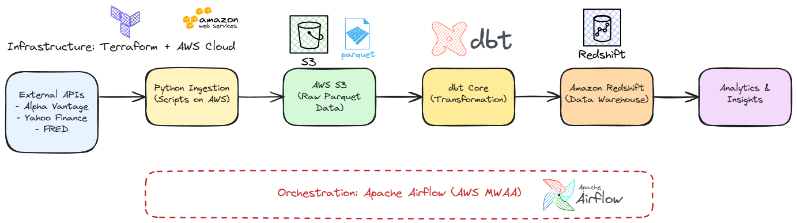

# 📈 Financial Data Pipeline - Sectoral Performance Analysis

## 🎯 Project Overview

Automated pipeline for analyzing sectoral performance of financial markets to identify investment trends and generate business insights.

### Key Features
- **Real-time data ingestion** from multiple financial APIs
- **Automated ETL pipeline** with Apache Airflow
- **Scalable cloud infrastructure** on AWS
- **Advanced financial metrics** calculation
- **Sectoral performance analysis** and risk management

## 🏗️ Architecture

### Technology Stack
- **Orchestration**: Apache Airflow (AWS MWAA)
- **Infrastructure**: Terraform + AWS
- **Data Lake**: AWS S3 (Parquet format)
- **Data Warehouse**: Amazon Redshift
- **Transformations**: dbt Core
- **Monitoring**: CloudWatch + Airflow UI

### Data Flow


## 📊 Data Sources

### APIs Used
1. **Alpha Vantage** - Daily stock prices, sector data
2. **Yahoo Finance** - Historical prices, company metadata
3. **FRED API** - Economic indicators, interest rates

### Data Collected
- **Stocks**: OHLCV prices, volumes, market cap
- **Sectors**: GICS sectors (Technology, Healthcare, Finance, etc.)
- **Indices**: S&P 500, sector indices
- **Macro**: Fed rates, inflation, VIX

## 🚀 Quick Start

### Prerequisites
- AWS Account with appropriate permissions
- Terraform >= 1.0
- Python 3.9+
- Git

### Installation

1. **Clone the repository**
   ```bash
   git clone https://github.com/yourusername/financial-data-pipeline.git
   cd financial-data-pipeline
   ```

2. **Setup environment**
   ```bash
   cp .env.example .env
   # Edit .env with your configurations
   ```

3. **Install dependencies**
   ```bash
   pip install -r requirements.txt
   ```

4. **Initialize Terraform**
   ```bash
   cd terraform
   terraform init
   cp terraform.tfvars.example terraform.tfvars
   # Edit terraform.tfvars with your settings
   ```

5. **Deploy infrastructure**
   ```bash
   make deploy-infrastructure
   ```

## 📁 Project Structure

```
financial-data-pipeline/
├── terraform/          # Infrastructure as Code
├── airflow/            # DAGs and Airflow configurations
├── python-scripts/     # Data ingestion and utilities
├── dbt/               # Data transformations
├── sql/               # Analytics queries
├── docs/              # Documentation
├── monitoring/        # Monitoring and alerting
└── scripts/           # Automation scripts
```

## 🔧 Configuration

### Environment Variables
```bash
# AWS Configuration
AWS_REGION=us-east-1
AWS_ACCOUNT_ID=123456789012

# API Keys
ALPHA_VANTAGE_API_KEY=your_key_here
FRED_API_KEY=your_key_here

# Database
REDSHIFT_CLUSTER_IDENTIFIER=financial-data-cluster
REDSHIFT_DATABASE=financial_data
```

### Terraform Variables
Key variables to configure in `terraform.tfvars`:
- `project_name`: Project identifier
- `environment`: dev/staging/prod
- `aws_region`: AWS region
- `redshift_node_type`: Redshift cluster size

## 📈 Business Use Cases

### 1. Sectoral Performance Analysis
- Compare sector returns (YTD, 1M, 3M, 1Y)
- Identify over/under-performing sectors
- Sector vs macro correlation analysis

### 2. Trend Detection
- Sectoral momentum (moving averages)
- Relative volatility by sector
- Sector rotation signals

### 3. Risk Management
- VaR calculation by sector
- Drawdown analysis
- Optimal diversification

## 🛠️ Key Metrics Calculated

### Returns
- Daily returns: `(close - close_lag1) / close_lag1`
- Cumulative returns
- Sharpe ratio by sector
- Alpha/Beta vs market

### Volatility
- 30-day rolling volatility
- Volatility clustering analysis
- Risk-adjusted returns

### Correlations
- Sector vs S&P500 correlation
- Cross-sector correlations
- Macro factor exposure

## 📊 Data Models

### Staging Layer
- `stg_stock_prices`: Clean daily stock prices
- `stg_sector_data`: Sector classifications
- `stg_macro_indicators`: Economic indicators

### Marts Layer
- `mart_sector_performance`: Sector performance metrics
- `mart_risk_metrics`: Risk and volatility measures
- `mart_trading_signals`: Investment signals

## 🔄 Daily Pipeline

```
6:00 AM : Overnight data ingestion
6:30 AM : Data quality validation
7:00 AM : dbt transformations
7:30 AM : Data quality tests
8:00 AM : Business metrics update
8:30 AM : Alerts and reports generation
```

## 🧪 Testing

### Unit Tests
```bash
pytest tests/unit/
```

### Integration Tests
```bash
pytest tests/integration/
```

### dbt Tests
```bash
cd dbt
dbt test
```

## 📚 Documentation

- [Architecture Overview](docs/architecture/infrastructure_overview.md)
- [Setup Guide](docs/setup/installation_guide.md)
- [API Documentation](docs/api/)
- [Business Metrics](docs/business/metrics_definitions.md)

## 🚨 Monitoring

### Data Quality Alerts
- Missing data detection
- Anomaly detection
- Schema validation

### Pipeline Health
- DAG success rates
- Processing times
- Error tracking

## 🤝 Contributing

1. Fork the repository
2. Create a feature branch
3. Make your changes
4. Add tests
5. Submit a pull request

## 📄 License

This project is licensed under the MIT License - see the [LICENSE](LICENSE) file for details.

## 👥 Authors

- Your Name - Initial work

## 🙏 Acknowledgments

- Alpha Vantage for financial data API
- Yahoo Finance for market data
- FRED for economic indicators
